<!-- 2026-10-03 20:52, design review screenshots (headless Chromium, mock data, 1280×800 unless "full") -->

# StayGuide design screenshots

> **New since the redesign (2026-10-04):** see [`new-screens/`](new-screens/) and the handoff [`docs/TRINITY_DESIGN_UPDATE.md`](../TRINITY_DESIGN_UPDATE.md).

These were captured on 2026-10-03 from the `design` branch in mock mode with headless Chromium. The tablet shots are at 1280×800 CSS px, which is a Galaxy Tab A11+ in landscape. They come from automated tests, not from a real device.

## Tablet: current redesign (`tablet/`)

Icon-only home, glass UI, clock and weather, and the 8 gradients from the Figma "Luxury Gradients" file.

**All 10 backgrounds**

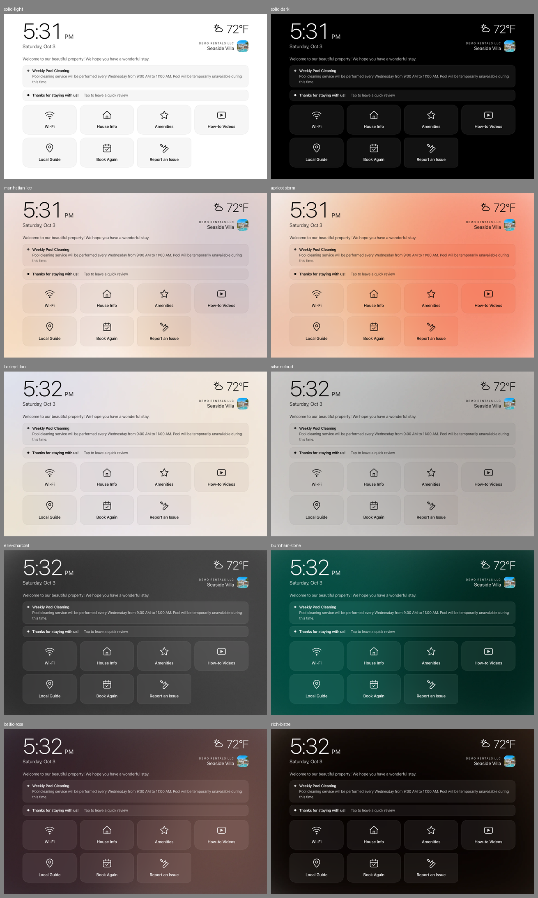

| Baltic Rose | Rich Bistre |
|---|---|
| 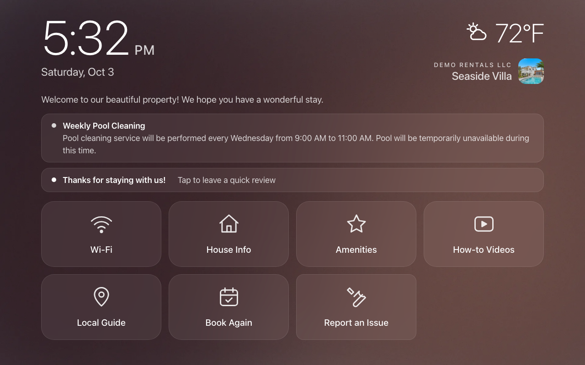 | 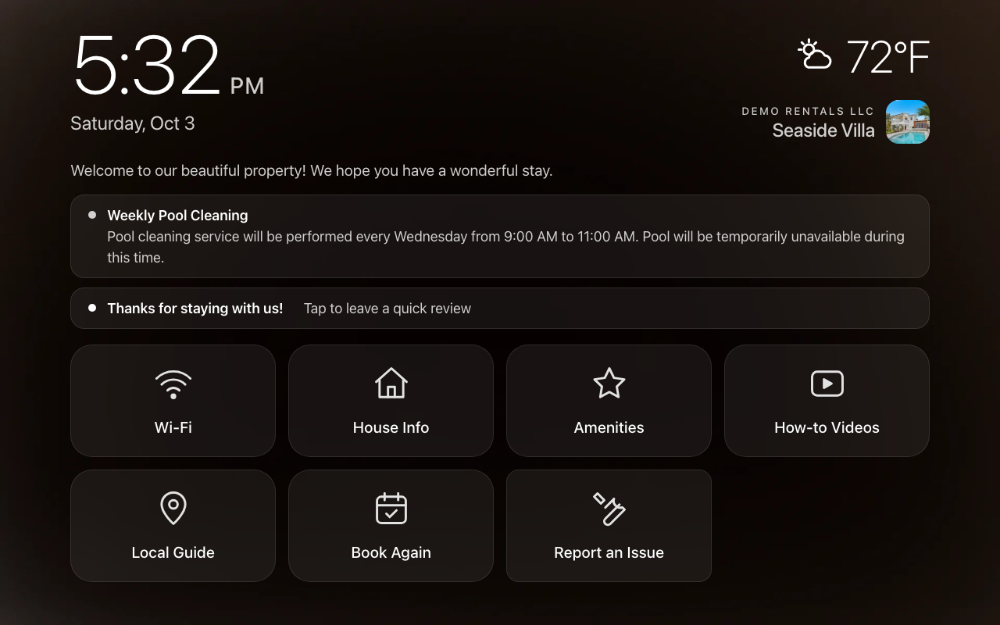 |
| **Apricot Storm** | **Solid dark** |
| 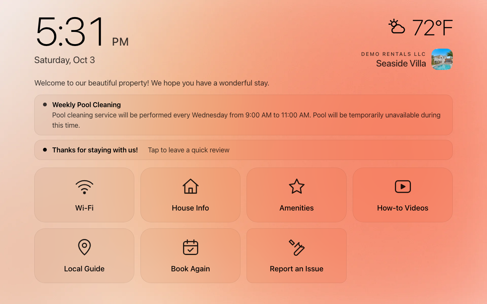 | 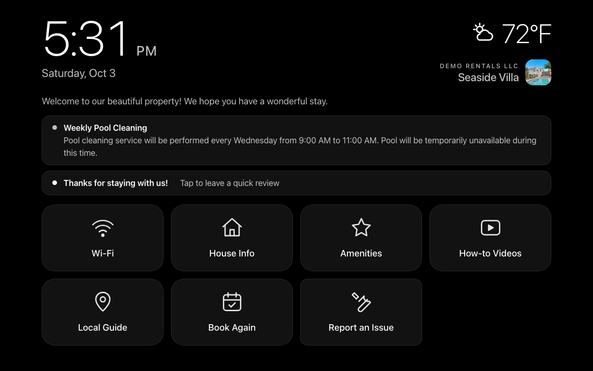 |

**Sheets over the blurred home**

| Wi-Fi (Apricot Storm) | Amenities (Baltic Rose) |
|---|---|
| 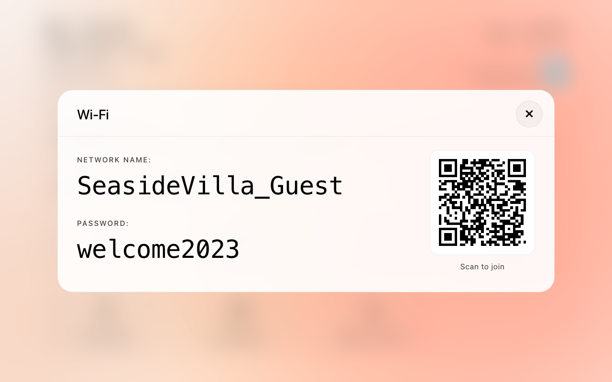 | 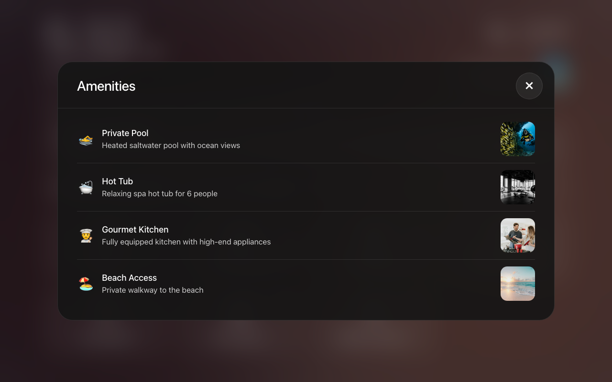 |
| **Local Guide (Silver Cloud)** | **Report an Issue (Baltic Rose)** |
| 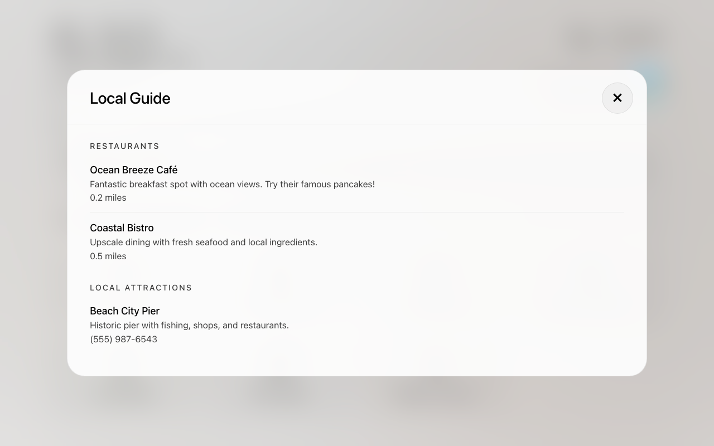 | 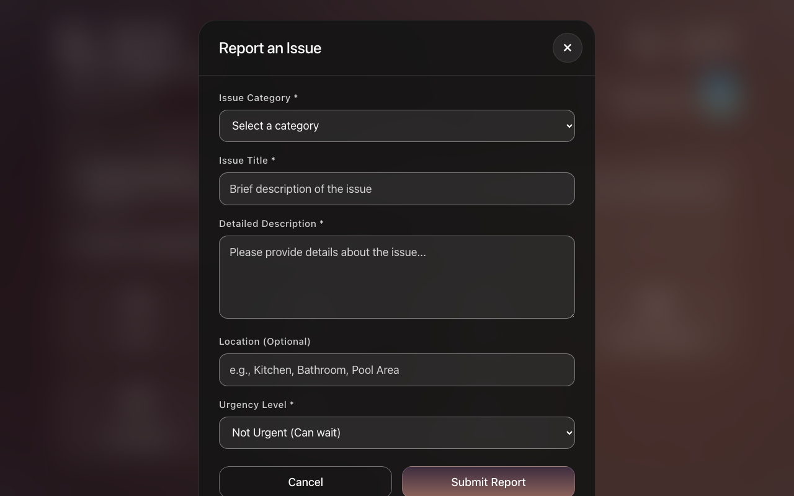 |

**Other files**
- Every background: `home-<slug>.png` (solid-light, solid-dark, image-dark, manhattan-ice, apricot-storm, barley-titan, silver-cloud, erie-charcoal, burnham-stone, baltic-rose, rich-bistre)
- Every sheet: `sheet-{wifi,amenities,guide}-{apricot-storm,baltic-rose,silver-cloud}.png`
- `video-modal-rich-bistre.png`, `tablet-pairing.png`

**Dashboard (Tablet Appearance)**

| Background picker | Weather location and clock |
|---|---|
| 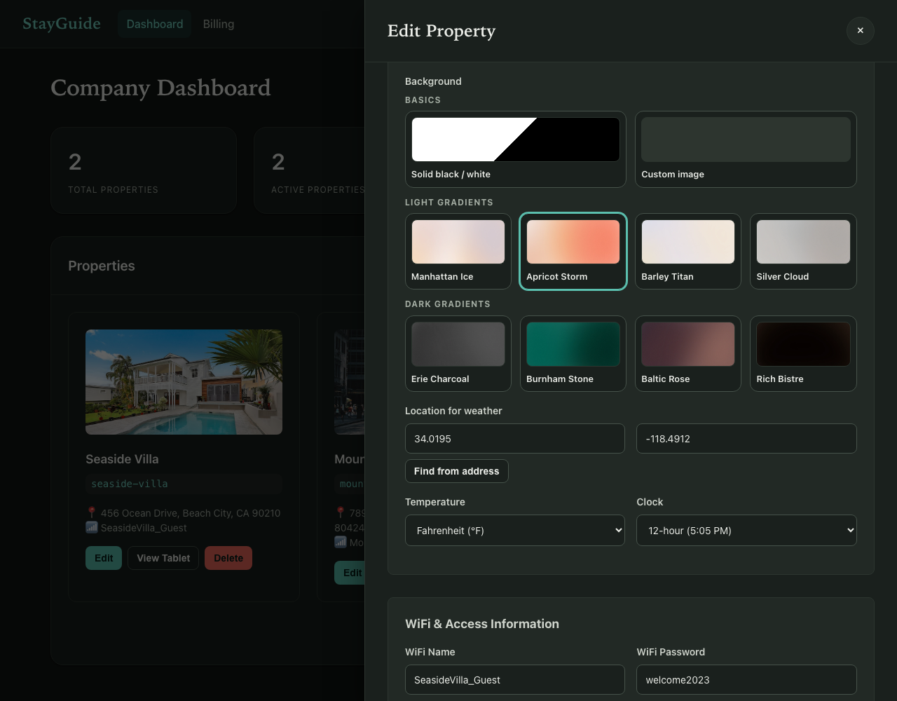 | 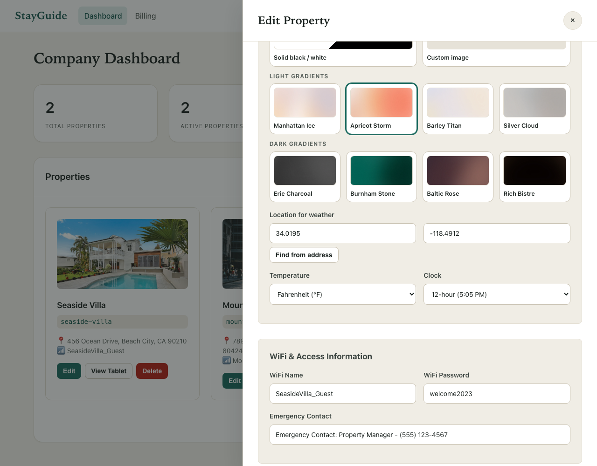 |

## Gradients (`gradients.png`)

Pre-rendered from the Figma file into `public/img/gradients/*.webp`. Top row, light: Manhattan Ice, Apricot Storm, Barley Titan, Silver Cloud. Bottom row, dark: Erie Charcoal, Burnham Stone, Baltic Rose, Rich Bistre.

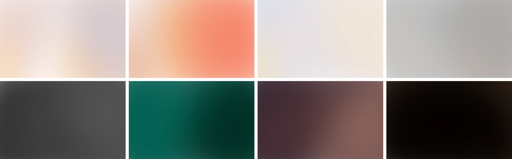

## Dashboards, landing and logins: light/dark themes (`ui-themes/`)

Captured in round 1 of the design system. Every file comes in a `-light` and `-dark` variant: `landing`, `landing-full`, `company-login`, `admin-login`, `company-dashboard`, `company-panel`, `admin-dashboard`, `admin-billing`, `company-billing`.

| Landing (light) | Company dashboard (dark) |
|---|---|
| 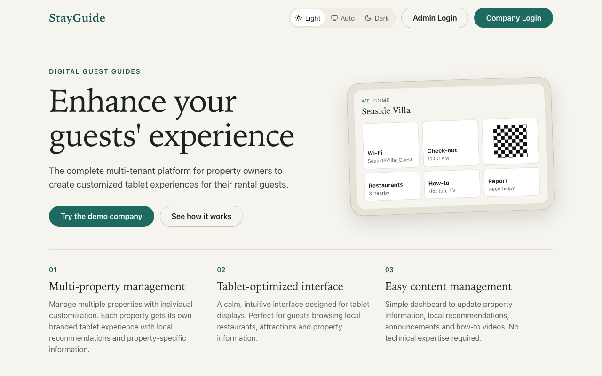 | 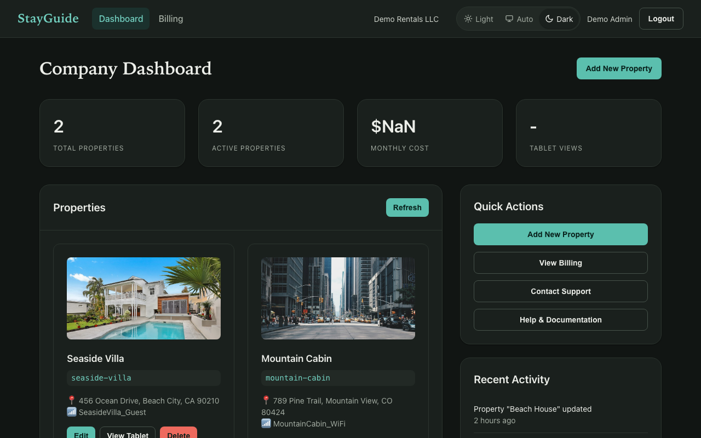 |

## Superseded (`tablet-round1-superseded/`)

The first-round tablet look, before the icon-only and gradient redesign. It is kept for reference only.
